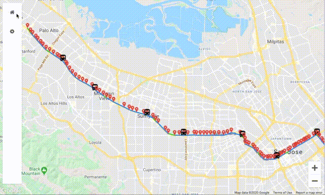

# bus-tracker

## Description



Bus Tracker is a real-time bus monitoring application, wrapped in a clean, friendly, and easy-to-use interface.

Features:
1) Visualize real-time bus locations instantly
2) Display all stops for your chosen bus line
3) Understand traffic conditions with route colors
4) Identify bus lines by mousing over any bus
5) Refresh in "Settings" to get the latest data

Bus Tracker currently supports VTA lines 22 and Rapid 522.

## About

Transit data was obtained via the 511.org API, map data and rendering was obtained via the Google Maps Javascript API.
The sidebar is modified from: https://github.com/Turbo87/sidebar-v2

## Use

For personal use, you will need to request both Open511 and Google Maps JavaScript API keys. Then, create
`js/config.js` and add your keys like so:
```
var keys = {
    google_maps: YOUR_GOOGLE_MAPS_API_KEY,
    open_511: YOUR_OPEN511_API_KEY
};
```
